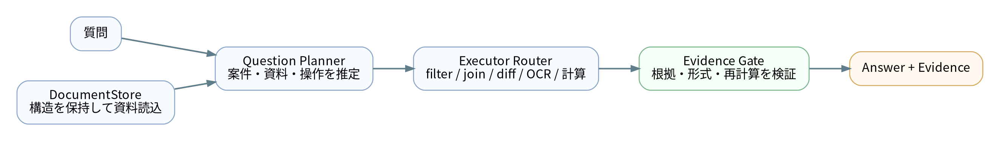
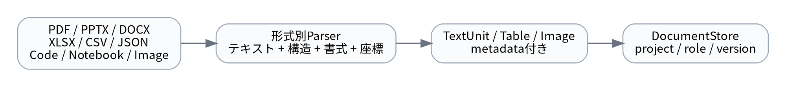
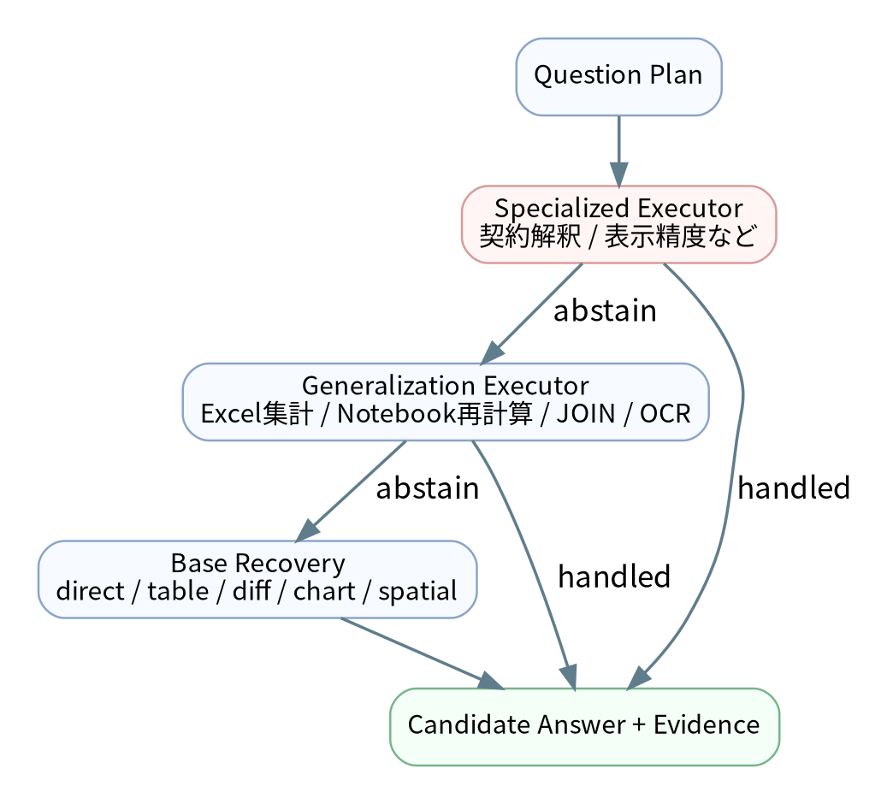
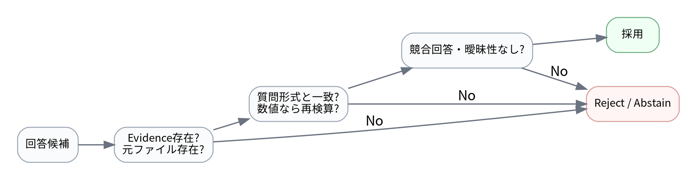
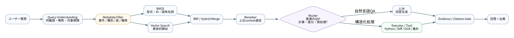
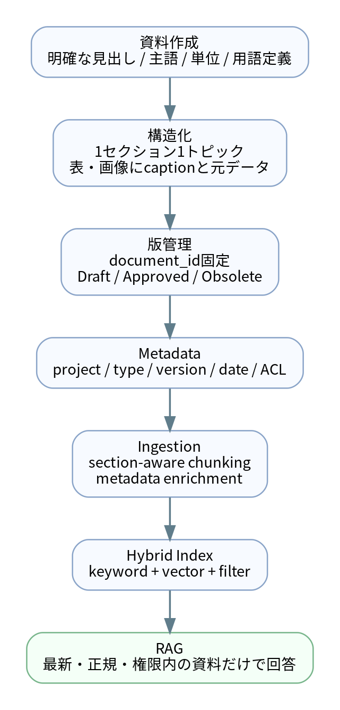
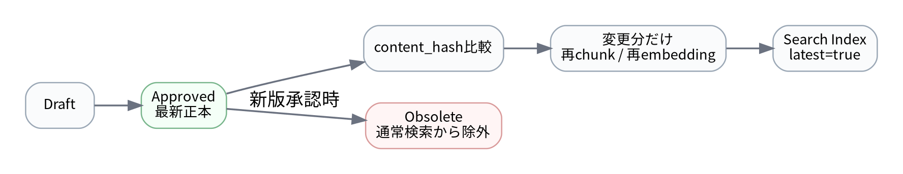

# ベクトル検索だけでは解けなかった――100問Document QAから学んだ「Executor + Evidence Gate」と、実務RAGの資料設計

> **公開用メモ**  
> 本記事では、コンペデータに含まれる固有名詞・実際の問題文・業務資料の内容は抽象化しています。実装構成と設計上の工夫に焦点を当てます。公開時には、利用したコンペの規約・データ利用条件に合わせて記載範囲を確認してください。

## はじめに

「複数の業務資料から質問に答えるRAG」と聞くと、最初に思い浮かぶのは、文書をチャンク化してEmbeddingし、ベクトル検索で関連箇所を取り出し、LLMに回答させる構成だと思います。

今回取り組んだDocument QAでは、PDF、PPTX、DOCX、XLSX、CSV、JSON、Python、Jupyter Notebook、画像など、性質の異なる資料を横断して100問へ回答する必要がありました。しかし実際に問題を見ていくと、単純な「意味検索 → 生成」だけでは対応しにくいものがかなり含まれていました。

たとえば、次のような問題です。

- Excelで条件に合う行だけを抽出して割合を計算する
- PowerPointの旧版・新版を比較し、実質的な変更だけを答える
- PowerPoint上で黄色に塗られたセルの意味を、元データから再計算する
- Wordの太字・斜体・コメント範囲を読む
- PDF内のグラフや表をOCRして、別資料のアクション一覧とJOINする
- Jupyter Notebookの出力グラフから最大目盛りを読む
- JSONの選択列とPythonの特徴量生成コードを突き合わせる
- 座席表の画像から「Aさんの右側」「Bさんの向かい」を幾何的に解く
- Time & Materials契約の「見込額」と「確定額」を区別する

このタイプのQAでは、**検索精度だけでなく、取得した資料をどう計算・比較・解釈するか**が問題になります。

その結果、最終的な構成は、一般的なベクトルDB中心のRAGよりも、

**Retrieval（資料を見つける） + Executor（資料を処理する） + Evidence Gate（根拠を検証する）**

という形に落ち着きました。

最終のコールドスタート検証では、保存済み回答や正解データを使わずに100問を再実行し、100/100問で回答とEvidenceを生成できました。Public評価は **0.7166666666666667** でした。なお、このコンペは完全正解だけでなく部分点や誤答ペナルティがあるため、この値は単純な正解率ではありません。

この記事では、最終的な仕組みと、そこに至るまでに重要だった考え方をまとめます。

さらに後半では、このコンペ向けシステムをそのまま業務へ持ち込むのではなく、**Vector / Hybrid RAGを主軸とした実務構成へどう変えるか**、そして**RAGが検索しやすい資料をどう作り、どう版管理するか**まで整理します。

---

## 1. 最終アーキテクチャ

最終形を一枚にすると、次のようになります。



重要なのは、質問をLLMへそのまま渡しているわけではない点です。

まず元資料を`DocumentStore`へ読み込み、質問文から案件名・ファイル名・必要な操作を推定します。そのうえで、問題タイプに対応したExecutorを順番に試し、回答候補とEvidenceを生成します。最後にEvidence Gateで「その回答を本当に採用してよいか」を検証します。

最終100問の実行では、外部API、過去回答、期待回答、Fact Catalogを使わず、元資料と質問だけから再生成しました。

```text
source_mode      : share.zipからcold prepare
prior_answers    : False
expected_answers : False
fact_catalog     : False
external_api     : False
answered         : 100 / 100
evidence         : 100 / 100
timeout          : 0
exception        : 0
```

この「完全に新しいworkspaceから再実行する」ことを、開発中は**コールドスタート**と呼んでいました。

---

## 2. 一番大きかった設計変更：すべてをテキストにしない

初期のRAGでは、どんなファイルもテキストへ変換し、同じチャンクとして検索したくなります。しかし、業務資料ではそれをやると重要な情報が落ちます。



たとえばPowerPointでは、「何が書かれているか」だけでなく、次の情報が答えになります。

- どのスライドにあるか
- 表の何行・何列か
- 図形がどこに配置されているか
- 文字色、太字、斜体、ハイライト
- 埋め込み画像やグラフ

Excelではさらに、セルの値だけでなく、数式、塗りつぶし、AutoFilter、条件付き書式、Chart XMLなどが必要になります。

そこで`DocumentStore`では、ファイルごとに構造を残したまま`TextUnit`とmetadataへ変換するようにしました。

### PDF

PDFは基本的にページ単位で保持します。通常のテキスト抽出で読めるものは`pypdf`等から取得し、画像PDFや図表については必要な問題だけOCR・画像解析へ回します。

### DOCX

DOCXは段落単位だけでなく、run単位の書式を保持します。

```python
runs = [
    {
        "text": run.text,
        "bold": bool(run.bold),
        "italic": bool(run.italic),
        "underline": bool(run.underline),
    }
    for run in paragraph.runs
]
```

この情報があることで、「太字かつ斜体の文字」「コメント対象の文字列」のような問いをテキスト検索ではなく構造として処理できます。

### PPTX

PPTXはスライド・shape・tableを直接解析します。差分問題では、単純な全文diffだけでなく、旧版と新版のスライド構成やテーブルの内容も比較します。

画像としてしか存在しない表や座席表は、PPTX内部の`ppt/media/`から画像を取り出して解析します。

### XLSX / XLSM

Excelは`openpyxl`を中心に、セル値だけでなく数式・fill・filter・chart・条件付き書式などを参照します。

「黄色セルを答える」という問題でも、黄色セルの表示値だけを返すのではなく、可能なら元データから同じ値を再計算します。これによって、「黄色っぽく見えたセルをOCRしただけ」という弱いEvidenceから、再計算可能なEvidenceへ変えられます。

### JSON / Python / Notebook

JSONとコードは、自然言語文書として検索するより、構造を直接読む方が確実です。

たとえば、

1. `metrics.json`の`selected_columns`を取得
2. `features.py`の特徴量生成規則を解析
3. 両者の積集合を取る

という処理ができます。

Notebookではセルのsourceだけでなく、outputsも保持します。グラフしか残っていない場合は、生成された画像まで確認します。

---

## 3. DocumentStore：検索の前に「資料の意味」を整理する

`DocumentStore`は、単なる全文検索用インデックスではありません。

起動時に共有フォルダ全体を走査し、各ファイルについて次の情報を持つmanifestを作成します。

```text
relative_path
extension
project
area
role
filename
version
size
```

ここで特に効いたのが、**project / role / versionの推定**です。

業務フォルダには、たとえば次のような役割があります。

```text
00.提案
01.契約
02.計画
03.会議録
04.分析
05.中間報告
06.最終報告
```

質問に「提案時と最終報告を比較」と書いてあるとき、意味検索だけで資料を選ぶのではなく、ファイルの役割を使って候補を絞れます。

また、正式名称と社内略称が混在するので、用語集やプロジェクト資料からaliasを自動取得しました。

```text
正式名称 ─┐
略称     ─┼→ 同じprojectとして解決
内部コード ─┘
```

これにより、「質問に書かれた略称」と「フォルダ名」が一致していなくても同一案件へ到達できます。

---

## 4. Question Planner：質問を「必要な操作」に分解する

次に質問文を見て、どんな処理が必要なのかを判定します。

最終実装では、質問から次のような情報を抽出しました。

- project hint
- filename hint
- 日付
- Task ID / Action ID等の識別子
- 操作：filter / groupby / sum / difference / rank / round / diff / join / chart / spatial relationなど

簡略化すると、次のようなルールです。

```python
if "比較" in question or "旧版" in question:
    route = "diff"
elif "太字" in question or "ハイライト" in question:
    route = "office_format"
elif "座席" in question or "向かい" in question:
    route = "spatial_layout"
elif "metrics.json" in question or "ipynb" in question:
    route = "code_json"
elif "全案件" in question or "上位3" in question:
    route = "cross_project"
```

これはLLMによる自由な計画生成ではなく、**高精度な操作ルーティング**を優先した設計です。

理由は、今回のデータでは「何をすべきか」がある程度パターン化できる一方、処理を間違えるともっともらしい誤答を作ってしまうからです。

---

## 5. Executorという考え方

このシステムで最も重要なのがExecutorです。

Executorは、

> 「特定の質問の答えを覚えている処理」ではなく、「特定タイプの資料操作を再現できる処理」

として作りました。



### 5.1 Specialized Executor

最上段には、誤ると影響が大きく、汎用Executorでは解釈がぶれやすかった処理を置いています。

例として、次のようなものがあります。

- PowerPoint上の表示精度を優先すべき数値問題
- T&M契約で「見込金額」と「確定請求額」を区別する問題

重要なのは、`question_id == 35`のような分岐にはしないことです。

質問文と資料内条件を確認し、条件が揃った場合だけ回答し、それ以外では`abstain`します。

```python
if not is_time_and_materials_contract:
    return abstain()
if final_actual_hours_are_missing:
    return answer_not_determinable_with_evidence()
return abstain()
```

### 5.2 Generalization Executor

監査で解き方が確立した処理は、汎用メソッドとしてGeneralization Executorへ追加しました。

実際のmethodには、たとえば次のようなものがあります。

```text
xlsx_yellow_pivot_recompute
pptx_semantic_equivalence_diff
notebook_target_correlation_recompute
regression_threshold_f1_optimization
priority_report_id_to_wbs_owner_join
local_ocr_spatial_layout
cross_project_monthly_settlement_ranking
xlsx_conditional_format_thresholds
pdf_rate_band_min_absolute_change
```

最終100問では、method名ベースで**88種類**の処理が使われました。

一見すると「88個もルールを書いたのか」と見えますが、重要なのは、問題文そのものに紐づけるのではなく、`Excelの条件付き書式`、`Notebookの相関再計算`、`版間diff`といった**操作単位**に落としたことです。

### 5.3 Base Recovery

上位のExecutorが回答できない場合は、汎用のBase Recoveryへフォールバックします。

Base Recoveryには次のrouteがあります。

```text
direct
table
document
cross_project
code_json
diff
office_format
chart
join
spatial_layout
```

`direct`は名前に反して「答えを直書きする」のではなく、高頻度の構造化処理を優先実行するExecutorです。

---

## 6. Evidence Gate：回答よりも「根拠」を先に信用する

Executorから文字列が返ってきても、そのまま採用しません。



Evidence Gateでは、最低限次を確認します。

1. 回答が空でない
2. confidenceが閾値以上
3. Evidenceが存在する
4. Evidence元のファイルが実際に存在する
5. Executor自身が曖昧と判定していない
6. 回答形式が質問と合っている
7. 数値問題ならraw値から丸めを再検算できる
8. 同程度のconfidenceで異なる回答が競合していない

たとえば「何ページですか」という質問に長文が返ってきたり、「何円ですか」に数値が含まれなければrejectします。

数値問題では、Executorがdiagnosticsに`raw_*`を残しておけば、Gate側でも丸めを独立確認します。

```python
if "切り上げ" in question:
    expected = math.ceil(raw)
elif "切り捨て" in question:
    expected = math.floor(raw)
else:
    expected = round(raw, requested_digits)

assert answer_value == expected
```

この仕組みはかなり重要でした。

RAGでは「根拠らしい文章が付いている」だけでも回答がもっともらしく見えます。しかし、**根拠のファイル・位置・計算過程まで追えること**を採用条件にすると、監査が圧倒的にやりやすくなります。

最終100問では、Evidenceは合計292件生成され、参照元ファイルの存在確認も292/292で通っています。

---

## 7. 画像・OCRは「最後の手段」ではなく、形式固有のParserとして使う

今回、OCRが必要だった代表例が座席表です。

座席表はPPTX内に一枚の画像として埋め込まれており、通常のPowerPointテキスト抽出では人物名・内線・席位置の関係が取れませんでした。

そこで、

1. PPTX内部から最大の画像を抽出
2. OpenCVで机の色を検出
3. 机の中心座標を取得
4. Tesseractで人物ラベルと内線をOCR
5. 各ラベルを最も近い机へ割り当て
6. N/E/S/Wの位置関係を構築
7. 「右」「向かい」を幾何的に解決

という処理を行っています。

ポイントは、OCR結果を文章としてLLMへ投げるのではなく、**OCR + 座標を構造化データに変換したこと**です。

```text
SeatOccupant(
    name="...",
    extension="7103",
    pod=2,
    position="W",
    label_center=(x, y),
    desk_center=(x, y)
)
```

これなら「向かい」は`E ↔ W`、`N ↔ S`という deterministic な処理になります。

---

## 8. 「資料を読めた」だけで終わらず、可能なら再計算する

今回の設計で一貫して意識したのは、**表示値をコピーするより、元データから再計算できるなら再計算する**ことです。

たとえば黄色ハイライトされたPivotの値を問われた場合、次の二段階で確認します。

```text
PPTX画像から黄色セルを特定
        ↓
行・列ラベルを取得
        ↓
元CSV/TSVから同条件をfilter/groupby
        ↓
同じ値になるか再計算
```

回帰モデルの問題でも、ワークブック上の表示を読むだけではなく、回帰係数と入力値から予測値を再計算します。

F1最大化問題では、予測値を作成し、候補閾値を走査してF1を再計算します。

この「再計算可能性」はEvidence Gateとも相性がよく、単なる文字列抽出よりかなり強いEvidenceになります。

---

## 9. 文書差分で難しいのはdiffではなく「実質的変更」の定義

PPTXの旧版・新版比較は、単純なXML差分だけなら簡単です。しかし質問が求めるのは、多くの場合「案件遂行に関係する実質的な変更」です。

ここでは、次の3種類を区別しました。

```text
A. 内容そのものが変わった
   例：担当者、期間、分析手順、対象範囲の変更

B. 同じ内容を詳しく書き直した
   例：既存の分析手順を図解・番号付けした

C. レイアウトだけ変わった
   例：1枚を2枚へ分割、表をSmartArt風に変更
```

機械的なdiffではBやCも大量に拾います。

そのため、差分Executorでは、テキスト差分を取ったうえで、旧版の意味内容が新版に包含されているかを確認し、単なる図表化を「実質変更」として数えないようにしました。

この部分は最終的にも解釈リスクが残った領域で、完全に機械化する難しさを感じたところです。

---

## 10. コールドスタート：保存した答えで正しく見える状態を禁止する

開発中に最も重視した検証は、コールドスタートでした。


一度正解を見ながら処理を直すと、知らないうちに正解値やquestion IDへ依存した実装になりがちです。

そこで最終確認では、毎回新しいworkspaceを作り、次だけを入力します。

```text
share.zip
questions.csv
source code
```

そして100問を1問ずつ別workerで実行します。

```python
python -m rag_recovery.audit50_worker \
  --prepared-root prepared_share \
  --index 42 \
  --question "..." \
  --output-json workers/042.json
```

各workerは結果をJSONで返し、オーケストレータが最終的に次を作成します。

```text
audit100_answers.csv
audit100_raw_results.jsonl
audit100_evidence.jsonl
predictions.csv
run_summary.json
```

1問ごとにプロセスを分けた理由は、OCRやOffice解析で一問が固まっても、100問全体を巻き込まないためです。question timeoutも設定しています。

最終実行では、

```text
prepare_seconds       12.217 sec
execution_wall        642.710 sec
total                 654.927 sec
answered              100 / 100
timeout               0
exception             0
```

となりました。

---

## 11. 最終100問はどのルートで解けたか

最終100問の回答経路は次のようになりました。


- Remaining50 Generalization: 49問
- Base Recovery: 30問
- Audit Generalization: 19問
- Specialized Executor: 2問

この分布を見ると、最終的には「汎用RAGひとつですべて解く」というより、**監査で得た知見を操作Executorへ一般化していく**方式が中心になっています。

ここは、このシステムの長所であると同時に限界でもあります。

未知のファイル形式や未知の問い方に対する柔軟性ではLLM中心のAgentに劣る一方、対応パターンに入った問題では、計算過程とEvidenceをかなり厳密に管理できます。

---

## 12. なぜ最終版では外部LLMを使わなかったのか

このシステムにはVision fallback用のクライアントも実装しました。しかし、最終コールドスタートでは外部APIを使っていません。

理由は、100問を監査していく中で、必要な処理を次のように分解できたからです。

```text
検索
→ 構造抽出
→ filter / join / diff / OCR / 計算
→ Evidence検証
```

つまり、今回の問題群では「文章を自然に生成する能力」よりも、**資料構造を壊さず、正しい処理を適用する能力**がボトルネックでした。

もちろん、別のデータセットで自由記述の要約や複雑な意味推論が中心ならLLMを使うべきです。

その意味で、本システムは「LLM不要」という主張ではなく、

> **LLMを使う前に、deterministicに解ける部分をExecutorへ寄せた**

という設計です。

---

## 13. うまくいかなかったこと

### 13.1 「とりあえず全文検索」は弱かった

業務資料では、値がどこに書かれているかだけでなく、セル色、グラフ、版、書式、契約種別などが答えを左右します。テキストだけへ潰すとEvidenceが欠落します。

### 13.2 回答率を上げるだけではスコアが上がらない

100/100問で何らかの回答を出せても、解釈が誤っていれば意味がありません。

特に危険だったのが、

- 見込額と確定額
- 内部の高精度値と資料上の表示値
- 表示順位と数値順
- 「変更」と「説明の具体化」

のような、**どちらも一見もっともらしいケース**です。

### 13.3 Exact Matchでは「余計な正しい情報」もリスクになる

ある質問で「略称のみ」を求められているのに、選定根拠の件数まで回答へ含めていました。

内容自体は正しくても、採点形式によっては不利になります。

最終的には、

```text
answer     = 質問が要求した最小限の文字列
evidence   = 選定根拠・計算値・資料位置
diagnostics= デバッグ用の中間値
```

と役割を分けました。

これは実務のQAシステムでも有効だと思います。

---

## 14. 技術スタック

最終チェックポイントのPython依存は概ね次の構成です。

| 用途 | ライブラリ / ツール |
|---|---|
| 基本処理 | Python 3.11+ / pandas / NumPy |
| Excel | openpyxl |
| Word | python-docx / lxml |
| PowerPoint | python-pptx |
| PDF | pypdf / PyMuPDF |
| 画像処理 | Pillow / OpenCV |
| OCR | pytesseract + Tesseract OCR |
| Office暗号化 | msoffcrypto-tool / LibreOffice |
| 機械学習再計算 | scikit-learn |
| テスト | pytest |

ローカル再現では、Pythonライブラリ以外にTesseract、LibreOffice、Poppler等の外部コマンドを用意しておくと安全です。

---


## 15. 実務へ持っていくなら、主役はベクトル検索RAGに戻す

今回のコンペでは、質問パターンを監査しながらExecutorへ落とし込めたため、最終的にはかなりdeterministicなシステムになりました。しかし、実際の社内利用では質問は事前に固定されません。

たとえば、次のような問い合わせが日々飛んできます。

- 「過去に同じような不具合はあった？」
- 「この試験条件を決めた根拠はどの資料？」
- 「この規格に関係する社内手順を探して」
- 「A案件と似た条件で実施した過去案件を教えて」
- 「この装置の注意事項をまとめて」

こうした**未知の自然言語質問へ広く対応する部分**は、ベクトル検索RAGの方が向いています。

一方で、次のような問いはベクトル検索だけに任せると不安が残ります。

- Excelの条件抽出・集計
- 旧版と新版の厳密な差分
- 数式を使う再計算
- JSONとPythonコードのJOIN
- 表示色・図形位置・座席位置の解釈
- 「確定値」と「見込値」のような業務ルール判定

そのため、実務版では**ベクトル検索RAGを入口にし、必要なときだけExecutor / Toolへ分岐する**構成が扱いやすいと考えています。



イメージとしては次の役割分担です。

| 質問 | 主に担当する仕組み |
|---|---|
| 手順・過去知見・規格・報告書の検索 | Hybrid RAG |
| 要約・説明・関連資料の提示 | Hybrid RAG + LLM |
| 条件付き集計・計算 | Executor / Python Tool |
| 文書の版間比較 | Diff Executor |
| 表・画像・グラフの読取り | Format Parser / Vision / OCR |
| 最終回答の根拠確認 | Evidence Gate |

つまり、今回作ったExecutorは捨てるのではなく、**「RAGが苦手な処理を任せる道具」として残す**のがよいです。

---

## 16. 実務版の検索は「ベクトル検索だけ」ではなくHybrid Retrievalにする

ベクトル検索は、質問と文書で使われる言葉が違っていても、意味が近ければ検索できるのが強みです。

一方、業務文書には次のような情報が大量にあります。

```text
装置型式: ABC-1200
試験ID: TST-2026-041
エラーコード: E1042
規格番号: ISO xxxx
材料名・部署名・人名・日付
```

こうした**固有名詞・型式・番号・略称**は、意味検索よりキーワード検索の方が強いことがあります。

Azure AI Searchの公式ドキュメントでも、Hybrid Searchは全文検索とベクトル検索を並列実行し、RRF（Reciprocal Rank Fusion）で統合する構成として説明されています。また、製品コード・専門用語・日付・人名などはキーワード検索が有効な例として挙げられています。[1]

そのため、実務向けには次の構成を基本にします。

```text
質問
  ↓
Query normalization / synonym expansion
  ↓
Metadata filter
  ↓
┌────────────────┬────────────────┐
│ BM25 / keyword │ Vector search  │
└────────────────┴────────────────┘
          ↓
       RRF統合
          ↓
       Reranker
          ↓
      Top-K chunks
          ↓
   LLM + Evidence
```

### Metadata Filterを検索より先に効かせる

ベクトル検索で「意味的に似ている資料」を全社から探すだけでは、別案件や旧版が混ざります。

たとえば質問から、

```yaml
project: PROJECT-A
status: approved
valid_at: 2026-08-01
access_group: team_measurement
```

のような条件を抽出し、検索対象を絞ってから類似度検索を行います。

Microsoftの検索ドキュメントでも、非ベクトルmetadataを使ったfilterは、検索対象の絞り込みやsecurity trimmingに使えるとされています。[2]

### Rerankerは「最後の10件を選ぶ」役

最初から高価なモデルで全チャンクを比較するのではなく、

1. BM25 + Vectorで数十件取得
2. RRFで統合
3. Cross Encoder / semantic rankerで上位だけ並べ替え
4. LLMへ渡す

という二段階構成にすると、速度と精度を両立しやすくなります。

---

## 17. Chunkingは文字数ではなく「意味のまとまり」を優先する

RAGを作ると、最初に「何文字でchunkを切るか」が話題になります。しかし、実務文書では固定文字数より**文書構造を保つこと**の方が重要です。

AzureのRAG向けChunkingガイドでも、大きな文書を適切な単位へ分割することは、埋め込みモデルの入力制限だけでなく、1つのvectorで内容を表現しすぎることを防ぐ意味でも有効とされています。[3]

おすすめは次の優先順位です。

```text
1. 見出し / セクション単位
2. 表・箇条書き・手順単位
3. 長すぎる場合だけtoken数で追加分割
```

たとえば次の文書がある場合、

```text
3. 試験条件
  3.1 温度条件
  3.2 撮影条件
  3.3 判定条件
```

`3.`全体を機械的に1000文字ずつ切るのではなく、`3.1`、`3.2`、`3.3`を別chunkにした方が質問との対応が明確になります。

各chunkには本文だけでなく、親の見出しを付けます。

```yaml
title: "試験報告書"
section_path:
  - "3. 試験条件"
  - "3.2 撮影条件"
content: "フレームレートは..."
```

これを**context enrichment**としてembedding対象テキストにも含めると、単独chunkになっても意味を失いにくくなります。AzureのChunk Enrichmentガイドでも、chunkのcleaningとmetadata追加がsemantic retrievalの改善に有効とされています。[4]

### Parent-Child構造も有効

細かいchunkは検索しやすい一方、回答生成には周辺文脈が不足します。

そこで、

```text
Child chunk  : 検索用の細かい単位
Parent block : LLMへ渡す広めの単位
```

に分ける方法があります。

たとえば検索は「3.2 撮影条件」だけでヒットさせ、回答時には「3. 試験条件」全体を取得します。

---

## 18. RAGが使いやすい資料管理とは何か

RAGの精度はモデルだけで決まりません。

実務では、**元資料の作り方・置き方・版管理の方が効く**ケースがあります。

AWSのRAG向け文書作成ガイドでも、企業文書にありがちな「構造化不足、metadata不足、画像やスクリーンショットへの依存」がretrievalを難しくする要因として挙げられています。[5] また、明確な見出し、簡潔な記述、用語の定義、一貫したテンプレートを新規文書へ適用することが推奨されています。[6]



### 18.1 「人間が読める」だけでなく「1セクション単独でも意味が分かる」ように書く

悪い例です。

```text
上記条件で実施した。
結果は以下の通り。
前回同様の傾向となった。
```

この文章だけchunkとして検索されても、何の条件・何の結果・どの前回なのか分かりません。

良い例は、

```text
試験ID TST-2026-041では、温度25℃、回転数2000 rpmで撮影した。
最大気泡径は前回試験TST-2026-035と同様に、回転数増加に伴って減少した。
```

のように、重要な主語・条件・参照先を明示します。

### 18.2 略語は文書内で定義する

```text
× 「以降、同条件でPIVを実施した」
○ 「Particle Image Velocimetry（PIV）を実施した」
```

略語辞書をRAG側に持つこともできますが、文書自体に定義がある方が堅牢です。

### 18.3 表には単位を列名として持たせる

```text
× Speed | 2000
○ Rotation speed [rpm] | 2000
```

数値だけがchunk化されたときにも意味が残ります。

Excelでは、可能なら以下を避けます。

- 大量のセル結合
- 空白セルで意味を表現する
- 色だけでステータスを表現する
- 1枚のSheetに複数の独立表を置く
- 単位を表の外側に1回だけ記載する

色を使う場合でも、

```text
Status = "NG"
Fill = red
```

のように、**色と意味をデータとして二重化**しておくとRAGだけでなく通常の集計にも有利です。

### 18.4 グラフの重要値は画像だけに閉じ込めない

```text
chart.pngだけ存在
```

より、

```text
chart.png
chart_data.csv
図3：温度と最大気泡径の関係
```

の方が圧倒的に扱いやすくなります。

少なくとも、グラフタイトル、軸名、単位、要点をcaptionや本文へ記載します。

### 18.5 Draft / Approved / Obsoleteを明確にする

RAGが最も危険なのは、旧版をもっともらしく引用することです。

ファイル名だけで、

```text
report_final.xlsx
report_final2.xlsx
report_最終.xlsx
```

と管理するのは避けます。

代わりに、document IDを固定し、metadataとして版を管理します。

```yaml
document_id: TEST-REPORT-0041
version: 3
status: approved
issued_at: 2026-07-31
supersedes: TEST-REPORT-0041:v2
```

検索時は原則、

```text
status == approved
AND latest == true
```

をfilterします。

旧版比較が必要な質問のときだけ過去版を検索対象に戻します。

### 18.6 権限をmetadataとして持つ

社内RAGでは「検索できた文書をLLMへ渡してよいか」が重要です。

```yaml
access_groups:
  - measurement_team
  - project_A
confidentiality: internal
```

のようなACL metadataをindexへ持たせ、**ユーザー権限でfilterした後にretrievalする**構成にします。

回答生成後に隠すのでは遅く、retrieval段階で見せてはいけないchunkを除外する必要があります。

---

## 19. 実務向けに最低限持たせたいmetadata

私は、フォルダ階層だけに意味を持たせるより、次のようなmetadataを明示的に持たせる設計がよいと考えています。

```yaml
# identity
document_id: TEST-REPORT-0041
title: "攪拌条件変更時の可視化試験報告"
document_type: test_report

# organization
project_id: PRJ-2026-012
department: measurement
owner: team-a

# lifecycle
version: 3
status: approved
issued_at: 2026-07-31
updated_at: 2026-08-02
latest: true

# retrieval
language: ja
tags:
  - imaging
  - bubble
  - agitation
entities:
  - "装置A"
  - "材料B"

# permission
confidentiality: internal
access_groups:
  - measurement_team

# traceability
source_path: "/projects/PRJ-2026-012/40_report/report_v3.pptx"
content_hash: "..."
```

chunk側にはさらに、

```yaml
chunk_id: TEST-REPORT-0041:v3:slide12:block03
parent_document_id: TEST-REPORT-0041
section_path: "結果 > 気泡径評価"
page: null
slide: 12
sheet: null
row_range: null
```

を持たせます。

こうすると、

- projectで絞る
- approvedだけ検索する
- 最新版だけ検索する
- slide 12を根拠として表示する
- 更新された文書のembeddingだけ再作成する

といった運用ができます。

サンプルは本プロジェクトの`templates/document_metadata.yaml`にも置いています。

---

## 20. フォルダ構成は「人間向け」、metadataは「機械向け」と割り切る

おすすめの例です。

```text
knowledge/
├── standards/                  # 規格・共通基準
├── procedures/                 # 標準手順
├── equipment/                  # 装置マニュアル・仕様
└── projects/
    └── PRJ-2026-012/
        ├── 00_meta/
        ├── 10_plan/
        ├── 20_execution/
        ├── 30_data/
        ├── 40_analysis/
        └── 50_report/
```

この階層は人間には分かりやすいですが、RAG側で、

> `40_analysis`に入っているから分析資料だ

とだけ判断するのは危険です。

ファイル移動やフォルダ名変更に弱いためです。

そのため、取り込み時に、

```text
フォルダ階層
+ ファイル本文
+ sidecar metadata
+ Office文書プロパティ
```

を統合してindex metadataへ変換します。



更新時は`content_hash`を比較し、変更された文書だけ再chunk・再embeddingします。削除・廃止された文書はvector DBからも削除またはinactive化します。

---

## 21. 実務導入を小さく始めるなら

最初から全社文書を取り込むより、対象を絞る方が成功しやすいです。

### Step 1：検索用途だけで始める

```text
対象：承認済み報告書・標準手順書
質問：過去事例、条件、根拠資料の検索
回答：必ず出典リンク付き
```

まずは**「答えを生成するシステム」より「目的資料を探すシステム」**として評価します。

### Step 2：Hybrid Retrievalへする

- Vector search
- BM25
- metadata filter
- reranking

を追加します。

### Step 3：頻出する構造化処理だけTool化する

利用ログから、

```text
「このExcelを集計して」
「旧版との差を教えて」
「この試験条件の平均値を出して」
```

が繰り返し出るなら、その処理だけExecutorへします。

ここで今回のコンペで作った設計が活きます。

### Step 4：Evidence評価を自動化する

最終回答に、

- 文書名
- ページ / slide / sheet
- section
- 引用chunk
- 計算に使った入力値

を付けます。

「それっぽい回答」ではなく、**人が数十秒で根拠確認できる回答**を目標にします。

---

## 22. コンペ版から実務版への対応表

| 今回のコンペ版 | 実務版での役割 |
|---|---|
| DocumentStore | Ingestion / Parsing / Metadata Enrichment |
| Question Planner | Query Understanding / Router |
| Specialized Executor | Tool / Function Calling |
| Generalization Executor | 定型業務ロジック |
| Base Recovery | Hybrid Retrieval + LLM fallback |
| Evidence Gate | Citation / Grounding / Validation |
| Cold Start | Regression Test / Evaluation Set |
| 人手監査 | Golden Dataset更新 / Failure Analysis |

実務版では、比率を逆転させます。

```text
コンペ版
Executor中心 ────────── RAG fallback

実務版
Hybrid RAG中心 ──────── 必要時だけExecutor
```

ここが今回の仕組みをそのまま社内展開するのではなく、**実務へ適用するときの一番大きな変更点**です。

---

## 23. 最終的に学んだこと

今回の開発を通じて、Document QAで重要だと感じたことは次の4点です。

### 1. Retrievalの前に、ファイル形式を理解する

PPTXの座標、Excelのfill、Wordのrunなど、資料の構造自体が情報です。

### 2. 質問タイプごとに「処理」を持つ

すべてをLLMのプロンプトで解決するより、filter、join、diff、計算、OCRのように処理へ分解した方が再現しやすいケースがあります。

### 3. AnswerとEvidenceを別物として管理する

回答は短く、Evidenceは詳しく。この分離によって採点形式にも監査にも対応しやすくなりました。

### 4. 正解を見た後こそコールドスタートする

「一度解けた」ことと「仕組みとして解ける」ことは別です。

新規workspaceで、元資料と質問だけから同じ結果を再現できるところまで確認して、初めてExecutor化が完了したと扱いました。

---

## 24. おわりに

最初は「文書をEmbeddingしてLLMに聞けばよい」と考えていましたが、最終的にはかなり違うシステムになりました。

今回のように、業務資料を横断して**正確な数値・差分・書式・計算結果**を答えるQAでは、生成AIそのものよりも、

```text
正しい資料へ到達する
    ↓
資料形式に合った処理を行う
    ↓
再計算・照合する
    ↓
根拠が成立したものだけ回答する
```

という地味な部分が精度を左右します。

RAGという名前で始めたものの、最終形は「検索付き生成」というより、**Evidenceを伴うDocument Execution Engine**に近くなりました。

この構成は万能ではありません。しかし、PDF・Excel・PowerPoint・Wordが混ざる実務のDocument QAを作る際には、ひとつの設計パターンとして使えるのではないかと思います。


---

## 参考資料

1. Microsoft Learn, *Hybrid search using vectors and full text in Azure AI Search*  
   https://learn.microsoft.com/en-us/azure/search/hybrid-search-overview
2. Microsoft Learn, *Filters for keyword and vector search in Azure AI Search*  
   https://learn.microsoft.com/en-us/azure/search/search-filters
3. Microsoft Learn, *Chunk large documents for RAG and vector search in Azure AI Search*  
   https://learn.microsoft.com/en-us/azure/search/vector-search-how-to-chunk-documents
4. Microsoft Learn, *RAG chunk enrichment phase*  
   https://learn.microsoft.com/en-us/azure/architecture/ai-ml/guide/rag/rag-enrichment-phase
5. AWS Prescriptive Guidance, *Challenges in source data that affect RAG applications*  
   https://docs.aws.amazon.com/prescriptive-guidance/latest/writing-best-practices-rag/challenges.html
6. AWS Prescriptive Guidance, *Writing best practices to optimize RAG applications*  
   https://docs.aws.amazon.com/prescriptive-guidance/latest/writing-best-practices-rag/introduction.html

