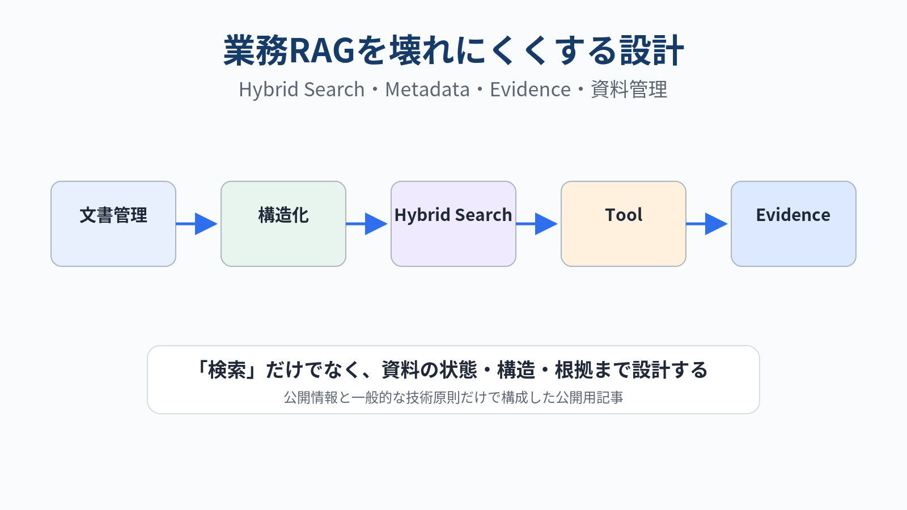
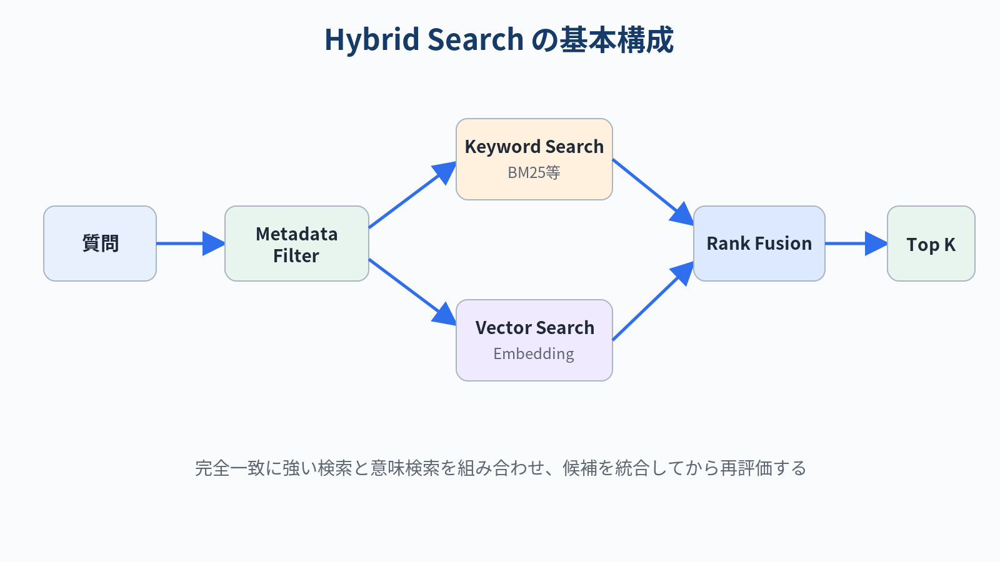
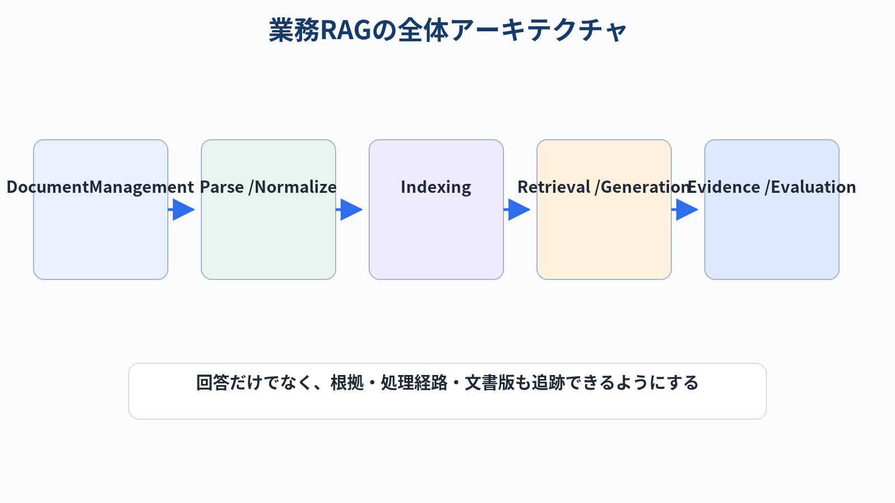
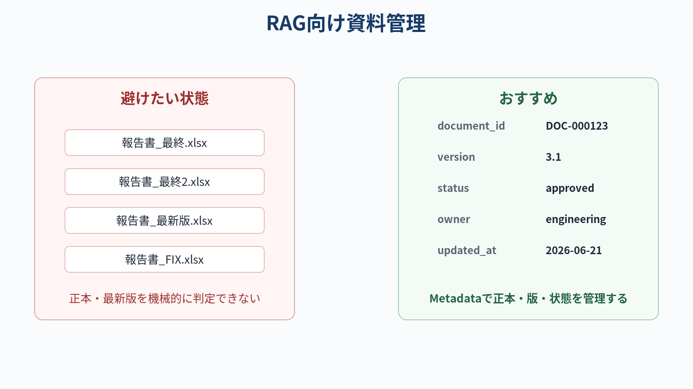
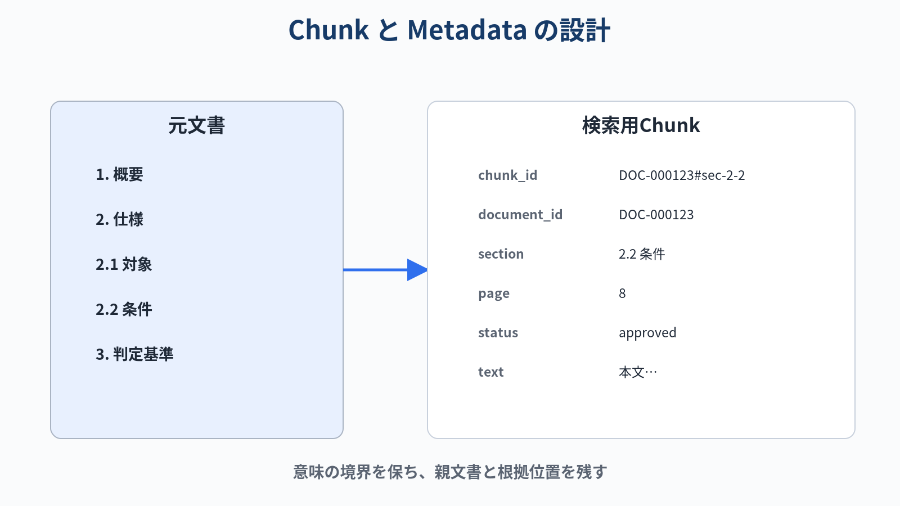
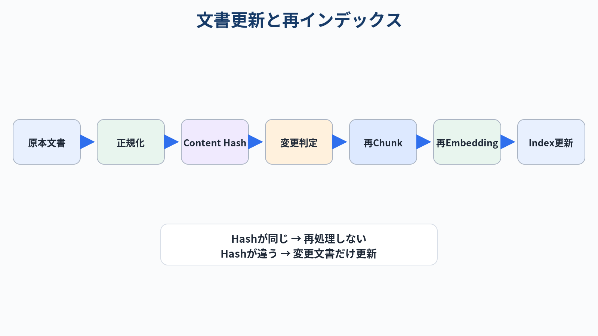
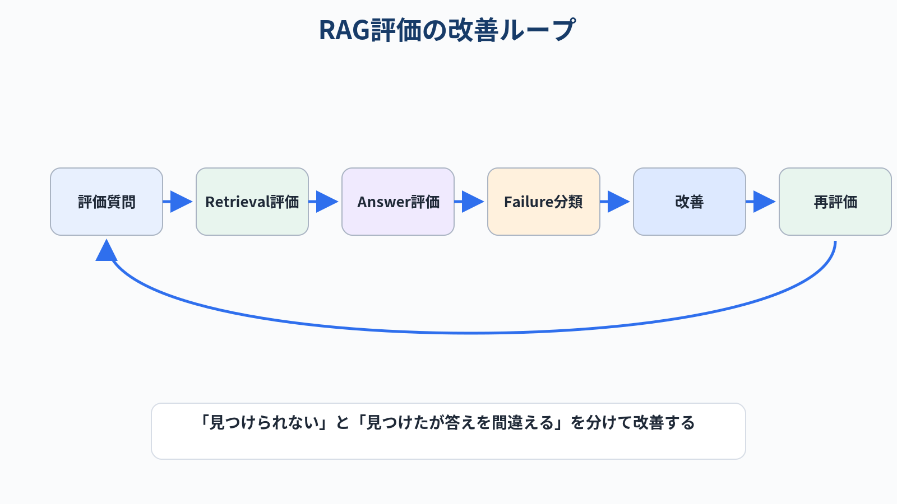

# 業務RAGを壊れにくくする設計：Hybrid Search・メタデータ・Evidence・資料管理

> この記事は、公開情報と一般的なRAG設計原則だけを使ってまとめた技術記事です。特定案件のデータや成果を前提とせず、再利用しやすい一般設計だけを扱います。

生成AIに社内・業務文書を参照させるとき、最初に思いつきやすいのが **RAG（Retrieval-Augmented Generation）** です。

ただし、実際に業務で使おうとすると「文書をベクトルDBに入れて類似検索する」だけでは足りません。

- 型式や文書番号を正確に探したい
- 最新版だけを参照したい
- PDF、Word、Excel、PowerPointが混在する
- 表のセルやシート名も検索したい
- 回答の根拠位置を残したい
- 計算や集計は検索ではなく確定的に実行したい
- 文書更新後に古い版を誤参照したくない

このような条件を考えると、業務RAGは単なる「ベクトル検索」ではなく、**検索・文書管理・構造化・検証を一体で設計するシステム**として考える方が扱いやすくなります。

この記事では、特定製品に依存しない形で、次の構成を紹介します。

1. 業務RAGの全体アーキテクチャ
2. Vector Searchとキーワード検索を組み合わせる理由
3. RAGしやすい資料管理
4. ChunkとMetadataの設計
5. Excel・表・画像を扱うときの考え方
6. 計算・集計をRAGから分離する方法
7. Evidenceを残す設計
8. 評価と更新の運用



---

## 1. 「Vector Searchだけ」で困りやすい理由

Embeddingを作り、質問と近いChunkを検索するVector SearchはRAGの中心技術です。

一方、業務文書にはVector Searchが苦手な情報も多く含まれます。

例えば次のような情報です。

- `AB-1234` のような型式
- `REV-C` のような版番号
- `T-042` のような管理番号
- 日付、金額、部署名、規格番号
- 資料タイトルそのもの

このような文字列は「意味が近い文章」を探すより、**文字列として一致する文書を探す方が強い**ケースがあります。

そのため、実務では次のようなHybrid Searchが扱いやすい構成です。



```text
質問
  ↓
Metadata Filter
  ↓
┌────────────────┬────────────────┐
│ Keyword Search │ Vector Search  │
│   (BM25等)     │ (Embedding)    │
└────────────────┴────────────────┘
          ↓
      Rank Fusion
          ↓
       Reranking
          ↓
     上位コンテキスト
```

Microsoft Azure AI Searchでも、フルテキスト検索とVector Searchを並列実行し、RRF（Reciprocal Rank Fusion）で統合するHybrid Searchが提供されています。

### Keyword Searchが強い例

```text
「AB-1234の改訂履歴を教えて」
```

### Vector Searchが強い例

```text
「異常振動が出たときに確認すべき項目は？」
```

両方を使うことで、**固有文字列への強さと意味検索への強さを両立**できます。

---

## 2. 業務RAGの全体構成

おすすめしたいのは、検索部分だけではなく前後も含めた次の構成です。



大きく分けると、5層です。

### ① Document Management

原本管理です。

- 文書ID
- 版
- ステータス
- 所有部署
- 作成日・更新日
- 機密区分
- アクセス権

を管理します。

### ② Parsing / Normalization

ファイル形式ごとの差を吸収します。

```text
PDF   → ページ
DOCX  → 見出し / 段落 / 表
PPTX  → スライド / テキスト / 図表
XLSX  → シート / 表 / セル範囲
CSV   → テーブル
画像  → OCR / Vision
```

### ③ Indexing

検索用データを作ります。

- Chunk text
- Embedding
- Keyword index
- Metadata
- Parent document reference

### ④ Retrieval / Generation

質問に応じて検索し、回答を生成します。

### ⑤ Evidence / Evaluation

回答と一緒に「どこを根拠にしたか」を保存します。

ここが業務利用では非常に重要です。

---

## 3. RAGしやすい資料管理とは何か

RAGの精度を上げる方法として、EmbeddingモデルやRerankerに目が行きがちです。

しかし、実際には **検索される側の資料管理** が大きく効きます。

### 3.1 文書に一意なIDを持たせる

例えば、次のようなファイル名だけの管理は避けたいです。

```text
報告書_最終.xlsx
報告書_最終2.xlsx
報告書_最新版.xlsx
報告書_修正版.xlsx
```

人間でもどれが正本か分かりません。

RAGならなおさらです。

おすすめは、ファイル名とは別に文書メタデータを持たせることです。

```yaml
document_id: DOC-000123
title: 設備評価レポート
version: "3.1"
status: approved
owner: engineering
created_at: 2026-04-10
updated_at: 2026-06-21
confidentiality: internal
supersedes: DOC-000123@3.0
```

### 3.2 Draft / Approved / Obsoleteを分ける

最低限でも、

```text
Draft
Approved
Obsolete
```

を区別できるようにします。

検索時には原則として、

```text
status = approved
```

だけを対象にします。

「古い版も検索したい」という質問のときだけObsoleteを含めます。

### 3.3 フォルダ階層を意味情報として使う

例えば、

```text
knowledge/
├── standards/
├── manuals/
├── test_reports/
├── meeting_notes/
└── specifications/
```

という分類があるなら、これを単なるパスとして捨てず、

```json
{
  "document_type": "test_report"
}
```

のようなMetadataへ変換しておきます。

### 3.4 「最新版」はファイル名で判断しない

```text
最新版
最新
final
final2
FIX
```

のような文字列に頼ると破綻します。

最新版判定は、

```text
document_id + version + status
```

で機械的に行えるようにします。



---

## 4. Chunkは「文字数」だけで切らない

RAGでは長い文書をChunkへ分割します。

単純な固定長分割は実装しやすい一方、業務文書では意味の境界を壊すことがあります。

例えば、

```text
3. 試験条件
  3.1 温度条件
  3.2 測定条件
  3.3 判定基準
```

という章があるとき、文字数だけで分割すると、見出しと本文が別Chunkになる可能性があります。

そこで、できるだけ次の単位を優先します。

- 見出し単位
- 段落単位
- 表単位
- スライド単位
- Excelの表・領域単位

Azure AI Searchの公式ドキュメントでも、大きな文書をRAGやVector Searchで扱う際にChunkへ分割する設計が説明されています。

### Parent-Child構造を残す

Chunkだけを保存するのではなく、親情報を残します。

```json
{
  "chunk_id": "DOC-000123#sec-3-2",
  "document_id": "DOC-000123",
  "section": "3.2 測定条件",
  "page": 8,
  "text": "..."
}
```

検索はChunk単位、回答時には親文書や前後Chunkまで広げる構成にすると、文脈を失いにくくなります。



---

## 5. Metadata Filterを積極的に使う

Vector Searchに全部任せるのではなく、検索前に候補を減らします。

例えば質問が、

```text
「2026年に承認された手順書から、安全確認の項目を探して」
```

なら、まず、

```text
year = 2026
status = approved
document_type = procedure
```

で絞ります。

その後にVector Searchをかけます。

Amazon Bedrock Knowledge Basesなどでも、文書Metadataを検索フィルターへ利用する仕組みが提供されています。

Metadataとして有用なのは例えば次です。

| Metadata | 用途 |
|---|---|
| document_id | 文書識別 |
| document_type | 種類絞り込み |
| title | タイトル検索 |
| version | 版管理 |
| status | Approvedのみ検索 |
| created_at | 時期絞り込み |
| owner | 部署・担当 |
| confidentiality | 権限制御 |
| page / slide / sheet | 根拠位置 |
| tags | 業務カテゴリ |

---

## 6. Excel・表は「文章」に潰しすぎない

ExcelをRAGへ入れるとき、全セルを単純に文字列化すると、表構造が失われます。

例えば、

| 条件 | 温度 | 結果 |
|---|---:|---:|
| A | 20 | 12.5 |
| B | 40 | 18.1 |

を、

```text
A 20 12.5 B 40 18.1
```

としてEmbeddingすると、行・列の関係が弱くなります。

最低限、

```text
条件=A / 温度=20 / 結果=12.5
条件=B / 温度=40 / 結果=18.1
```

のように構造を残します。

さらに実務では、

- sheet_name
- table_name
- row_key
- column_name
- cell_range

をMetadataに持たせると扱いやすくなります。

### RAGで検索、計算はコードで行う

例えば、

```text
「温度40℃以上の平均値を求めて」
```

という質問に対して、LLMへ表を渡して暗算させるより、

1. RAGで対象表を特定
2. pandas等でフィルタ
3. 平均値を計算
4. 計算条件と結果をLLMへ渡す

という構成の方が安定します。

---

## 7. RAGとTool / Executorを分ける

すべてをRAGで解こうとすると不安定になります。

質問タイプを大きく2つに分けます。

### Retrieval向き

```text
「この仕様書では安全率をどう定義している？」
```

→ 文書検索＋生成

### Tool向き

```text
「この表で条件Aだけの平均を計算して」
```

→ 表検索＋Python処理

```text
「版Aと版Bで変更された項目を一覧化して」
```

→ 文書取得＋Diff処理

おすすめは次の形です。

```text
Question Router
   ├─ Document QA → Hybrid RAG
   ├─ Table Calc  → pandas
   ├─ Diff        → structured diff
   └─ Image/Table → OCR / Vision
```

RAGは**資料を見つける役割**、Toolは**確定的な処理をする役割**と考えると整理しやすいです。

---

## 8. Evidenceを回答と同じくらい重要にする

業務利用では「答えが合っている」だけでは足りません。

例えば回答を次の構造で保存します。

```json
{
  "answer": "推奨値は15 mmです",
  "evidence": [
    {
      "document_id": "DOC-000123",
      "section": "4.2 設計条件",
      "page": 12
    }
  ],
  "route": "hybrid_rag",
  "confidence": 0.91
}
```

これにより、

- 根拠確認
- 誤答分析
- 文書更新時の影響調査
- システム改善

が行いやすくなります。

### 「分からない」を設計する

根拠が弱いときに無理に回答しないことも重要です。

```text
十分な根拠が取得できない
        ↓
回答を保留
        ↓
検索条件を変える / 人に確認
```

誤った回答を自信満々に返すより、安全です。

---

## 9. 文書更新をどう反映するか

全文書を毎回Embeddingし直す必要はありません。

文書ごとにHashを持ちます。

```text
content_hash = SHA256(normalized_content)
```

前回とHashが違う文書だけ、

1. 再Parser
2. 再Chunk
3. 再Embedding
4. Index更新

します。

削除・廃止された文書はIndexから除外します。



---

## 10. 評価データは公開・合成データで作る

RAGを改善するには評価セットが必要です。

ただし、公開記事やサンプルコードでは、機密文書そのものを評価データに使う必要はありません。

例えば架空の文書を作り、次のタイプを含む質問セットを用意できます。

```text
単純検索
複数文書参照
版管理
数値抽出
表計算
該当なし
根拠不足
```

そして、検索と回答を別々に評価します。

### Retrieval評価

- Recall@K
- MRR
- nDCG

### Answer評価

- Exact Match
- LLM Judge
- Citation accuracy
- Abstention accuracy



重要なのは、

```text
回答が違った
```

だけで終わらず、

```text
資料を見つけられなかった
        ↓
Retriever問題

資料は正しかったが回答を間違えた
        ↓
Generator / Tool問題
```

とFailure Stageを分けることです。

---

## 11. 最初から大規模に作らない

業務RAGを作るなら、次の順で育てるのがおすすめです。

### Phase 1：検索だけ

```text
質問 → 関連資料Top5
```

まずRetrieverを評価します。

### Phase 2：回答生成

```text
質問 → Retrieval → LLM → Evidence付き回答
```

### Phase 3：Hybrid化

```text
BM25 + Vector + Metadata
```

### Phase 4：Tool追加

頻出する処理だけTool化します。

```text
Excel集計
版差分
単位変換
決まった計算
```

### Phase 5：運用設計

- ACL
- 最新版管理
- 更新検知
- 監査ログ
- 評価セット

を追加します。

---

## 12. RAG Readyな資料のチェックリスト

資料を作る側にも少し工夫してもらえると、RAGはかなり使いやすくなります。

### 文書

- [ ] タイトルが明確
- [ ] 見出し階層が使われている
- [ ] 文書IDがある
- [ ] 版番号がある
- [ ] Draft / Approved / Obsoleteが区別できる
- [ ] 作成日・更新日がある
- [ ] 略語が初出時に定義されている

### 表

- [ ] 列名が一意
- [ ] 単位が列名またはMetadataにある
- [ ] 結合セルに意味を依存しすぎない
- [ ] 色だけで意味を表さない
- [ ] 表タイトルがある

### 図・画像

- [ ] キャプションがある
- [ ] 図番号がある
- [ ] 本文から参照されている
- [ ] 重要な数値が画像だけに閉じていない

### 運用

- [ ] 正本が一意に決まる
- [ ] 古い版を判別できる
- [ ] アクセス権をMetadataへ反映できる
- [ ] 削除・更新をIndexへ同期できる

---

## まとめ

業務RAGを安定させるには、Embeddingモデルだけではなく、**検索される資料の設計まで含めて考える**必要があります。

特に重要だと考えているのは次の5点です。

1. **Vector SearchだけでなくKeyword Searchも併用する**
2. **Metadataで検索対象を絞る**
3. **Chunkへ文書構造を残す**
4. **計算・差分などはToolへ分離する**
5. **Evidenceと文書ライフサイクルを最初から設計する**

RAGは「LLMに文書を読ませる仕組み」というより、

> **組織の文書を、機械が検索・検証しやすい状態に整える仕組み**

と考えると、設計方針がかなり明確になります。

---

## 参考資料

- [Microsoft Learn - Hybrid Search in Azure AI Search](https://learn.microsoft.com/en-us/azure/search/hybrid-search-overview)
- [Microsoft Learn - RRF ranking in Hybrid Search](https://learn.microsoft.com/en-us/azure/search/hybrid-search-ranking)
- [Microsoft Learn - Chunk documents for RAG and vector search](https://learn.microsoft.com/en-us/azure/search/vector-search-how-to-chunk-documents)
- [AWS - Include metadata in a data source to improve knowledge base query](https://docs.aws.amazon.com/bedrock/latest/userguide/kb-metadata.html)
- [AWS - Configure and customize queries and response generation](https://docs.aws.amazon.com/bedrock/latest/userguide/kb-test-config.html)
